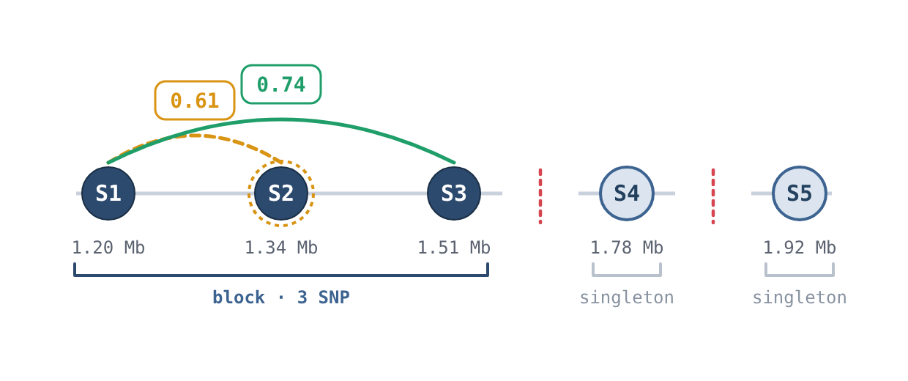
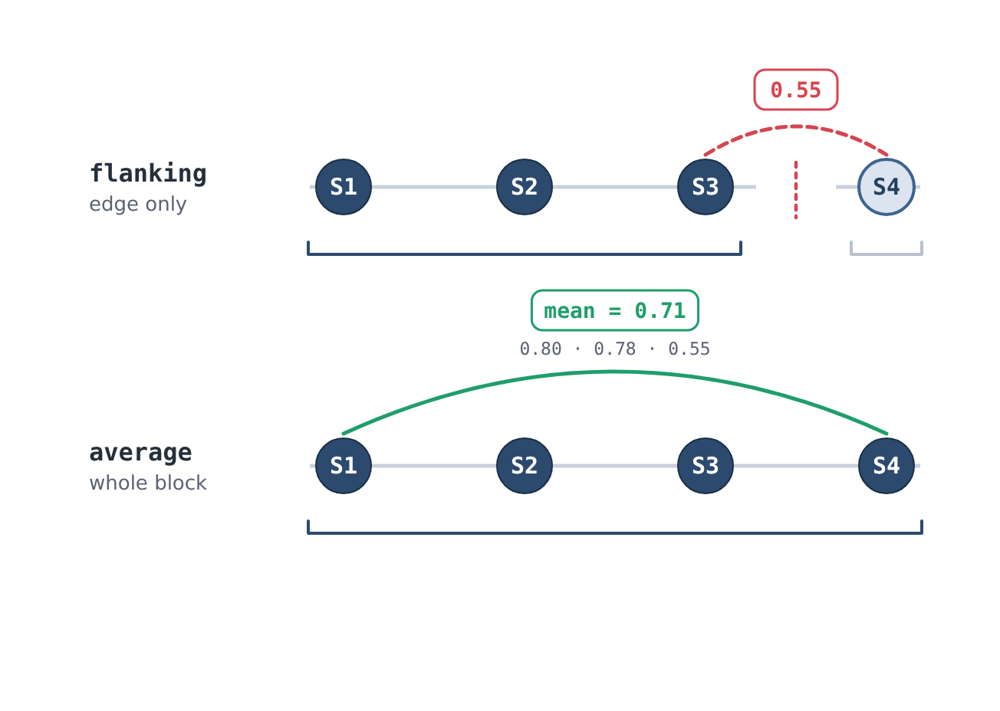
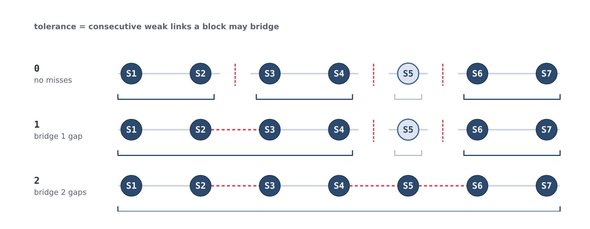
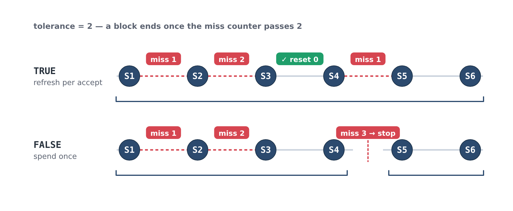
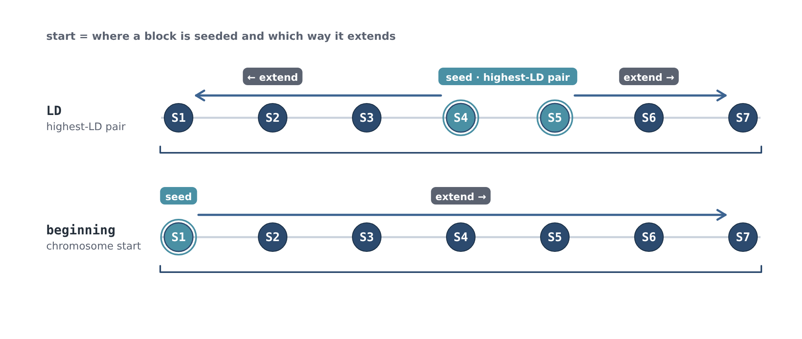

# Haplotype Blocks

Haplotype blocks (haploblocks) are contiguous genomic regions with high internal LD, defined here using a flanking-marker method.

## `def_blocks()`

Partitions the genome into haploblocks from a pairwise LD matrix.

```r
haploblocks <- def_blocks(
  ld        = ld_pairs,
  map       = map,
  method    = "flanking",
  threshold = 0.2,
  tolerance = 4,
  tol_reset = TRUE,
  start     = "LD",
  parallel  = FALSE
)
```

| Parameter | Description |
|-----------|-------------|
| `ld` | Pairwise LD output from `pairwise_ld()` or `plink_pairwise_ld()` |
| `map` | Ordered marker map |
| `method` | Block definition method (`"flanking"` or `"average"`) |
| `threshold` | Minimum r² value to consider adding a marker to the block |
| `tolerance` | Integer number of markers allowed to fall below threshold before terminating a block |
| `tol_reset` | If `TRUE`, reset tolerance counter when a marker is successfully added to a block |
| `start` | Seed strategy for block boundaries (`"LD"` or `"beginning"`) |
| `parallel` | Use parallel processing via `furrr` |

**`method`**

- `"flanking"` → compares the LD of the adjacent marker only (i.e., compares current first/last marker in the block to the next marker)
- `"average"` → compares average LD across block (i.e., averages the next marker's LD to all markers currently in the block)

**`tolerance`**
- If the next marker to compare does not meet or exceed `threshold`, the counter is incremented by 1. Once the counter is greater than the `tolerance` value the block is terminated. Any markers between a successfully added marker and a the block that did not meet the threshold will also be added to the block. This parameter helps to accommodate for reference alignment error, genotyping error, structural variation, and other systematic errors

**`tol_reset`**
- `TRUE` the `tolerance` counter is reset to 0 when a marker meets the threshold.
- `FALSE` the counter is not reset and will keep incrementing even if a marker is successfully added.

**`start`**
- `LD` -> starts from the highest LD pair and the block will be extended both to the left and to the right according to the distance coordinate. The tolerance counter is reset between left extension and right extension.
- `"beginning"` -> starts at the beginning of the chromosome, so blocks are only extended to the right.

## How blocks are built

`def_blocks()` walks along a chromosome and extends a block one marker at a time,
absorbing markers while LD stays high and closing the block off to start a new
one where it drops away. The diagrams below illustrate how the parameters above
shape that process.

In each diagram, circles are markers laid out in physical order along the
chromosome. A grey line is a strong link (LD ≥ `threshold`) and a dashed red line
is a weak link (LD below `threshold`). A bracket underneath groups the markers
that end up in one block, and an upright dashed red line marks a block boundary.

> LD values in these diagrams are illustrative, chosen to make each behaviour
> visible.

### Growing a block

A block grows outward from a seed. Each new marker (the *candidate*) is compared
against the block; if the LD clears `threshold` the candidate joins. A marker
that falls short isn't dropped straight away. It can be **tolerated** and
absorbed if a later marker reaches back across it. Where LD stays too low, the
block is closed off and the next block begins.



Here `S2` is a weak link (`0.61`), but the block reaches across it to `S3`
(`0.74 ≥ 0.70`), so `S2` is pulled in. Extension later runs out of road, so the
block ends and `S4` and `S5` are left as their own single-marker blocks.

### `method`: what a candidate is compared against

`flanking` compares the candidate to the block **edge** only; `average` compares
it to the **mean** LD across the whole block. Same markers, opposite result:
under `flanking` the weak `LD(S3, S4) = 0.55` ends the block, while under
`average` the strong ties to `S1` and `S2` lift the mean to `0.71` and `S4`
joins.



### `tolerance`: how many weak links a block bridges

`tolerance` is the number of consecutive weak links the block may span before it
gives up. On the same LD landscape, raising it bridges wider gaps, producing
fewer, longer blocks and fewer singletons.



### `tol_reset`: whether an accepted marker forgives past misses

Each weak link the block spans adds to a miss counter, and the block is closed
off once that counter passes `tolerance`. `tol_reset` decides whether accepting a
marker resets the counter. With `tolerance = 2` in both rows below: under `TRUE`,
absorbing `S4` resets the counter, so the later weak link is affordable and the
block runs to the end; under `FALSE`, the two early misses have already spent the
budget, so the next weak link closes the block.



### `start`: where a block is seeded and which way it grows

`start` sets the seed and the growth direction. `"LD"` seeds from the highest-LD
adjacent pair and extends in **both** directions, resetting the tolerance counter
between the left and right passes. `"beginning"` seeds at the first marker on the
chromosome and extends **rightward** only.



## `block_obj_to_df()`

Converts the block list object to a tidy data frame for downstream use.

```r
haploblocks <- block_obj_to_df(haploblocks, map)
```

The resulting data frame has one row per haploblock with columns for block ID, chromosome, start/end position, and constituent markers. The constituent markers are `;` delimited.

!!! warning 
    Do not use any kind of whitespace as a delimeter, this will not be considered a delimeter and will be part of the marker name!

## Important Note
A custom haploblock dataframe may be provided for downstream steps. It must, however, be formatted the same with the same column names! At minimum, the `Block`, `Block_ID`, `First_SNP`, `Last_SNP`, and `Chrom` columns must be provided! The `Block` column should contain the list of markers in the block separated by `;` (no whitespace!), the `Block_ID` should be a character and a unique identifier, `First_SNP` and `Last_SNP` should be the character name of the first and last SNP making up the block in `Block`, and `Chrom` should be a numeric positive integer value.

```r
head(haploblocks)
```
