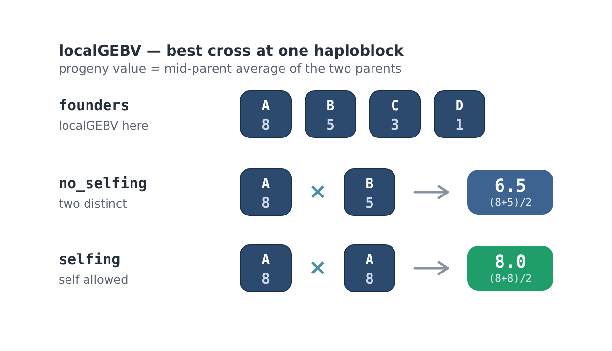
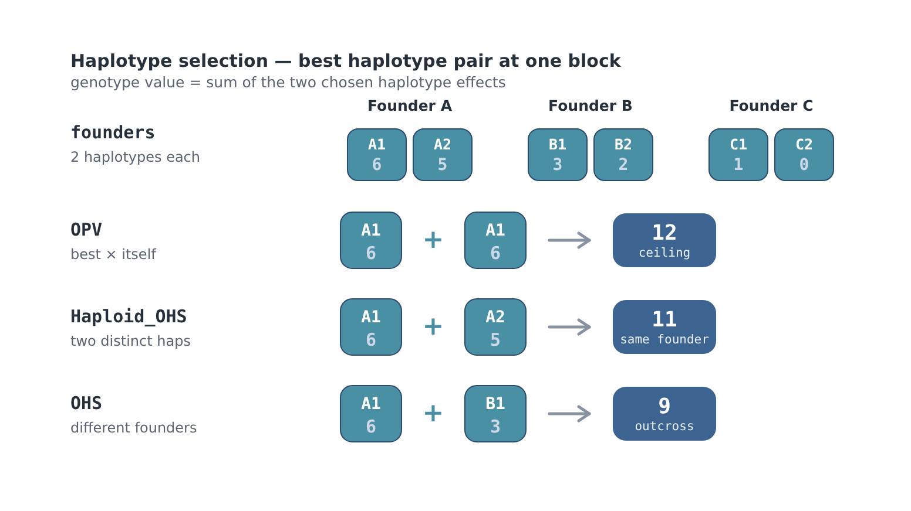
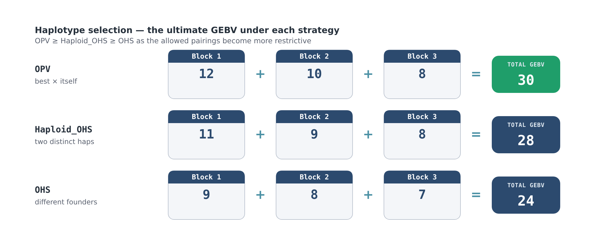
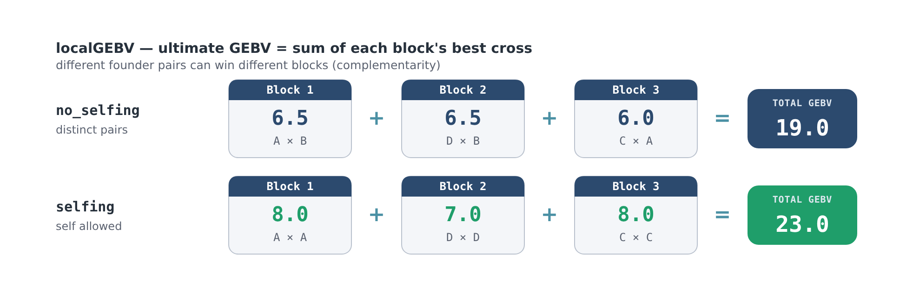

# Parent Selection

## How the Genetic Algorithm Works

The HapSelect genetic algorithm (GA) for localGEBV or haplotype effects attempts to identify a founder set of individuals from a larger population that maximises the potential to recover favourable localGEBV or haplotype effects across the selected haploblocks.

Rather than optimising overall GEBV directly, which often limits diversity, the GA optimises the ability of the selected founder pool to produce elite offspring across genomic regions if the best regions could be simultaneously combined. This is the core idea behind "The Ultimate Genotype" presented in [Hayes et al., 2024](https://doi.org/10.1038/s41588-024-01942-0). While it is currently impossible to construct an ultimate genotype in practice, these tools excel in maintaining diversity while providing potential for long-term genetic gain in breeding programs. The package implements fitness functions that the GA uses to optimise for both localGEBV and haplotype effects with different strategies (see package citation). Custom fitness functions can also be provided - we plan to offer an extensive guide to this in the future.

The GA core algorithm relies on the following R package while the fitness, mutation, and crossover functions are custom designed in HapSelect:

[GA: Genetic Algorithms](https://cran.r-project.org/web/packages/GA/index.html)

---

## The Optimisation Objective

For each haploblock:

1. All possible pairwise crosses among the selected founders (localGEBV) or chromosomes (haplotypes) are evaluated
2. Combinations that violate optimisation conditions (for example, selfing in localGEBV or haplotypes derived from the same parent with optimal haplotype stacking) are removed. This depends on the `strategy` argument.
3. The expected offspring localGEBV for each cross is calculated (average of parental localGEBV or sum of chosen haplotypes)
4. The highest-scoring cross for that haploblock is retained
5. The process repeats across all haploblocks
6. The average localGEBV or haplotype sums ("fitness") values are summed across haploblocks to determine "The Ultimate GEBV" for each set of founders across the entire genome.

The GA therefore attempts to maximise:

- favourable haplotype complementarity
- genomic coverage of elite haplotypes
- the best achievable offspring configuration across blocks that meet optimisation constraints (e.g., limited starting founders from a large population)

rather than simply selecting the individuals with the highest total GEBV (truncation selection, TS).

---

## The Fitness Function

### localGEBV
Conceptually, the fitness function is:

$$
\mathrm{Fitness} = \sum_{j=1}^{J} \max_{(i,k)} \left( \frac{localGEBV_{ij} + localGEBV_{kj}}{2} \right)
$$
where:

| Symbol | Meaning |
|:---|:---|
| *J* | Number of selected haploblocks |
| $localGEBV_{ij/k}$ | localGEBV of individual `i` or `k` at haploblock `j` |
| *(i,k)* | Pairwise unique founder combinations (same for all haploblocks) |

For each block, the GA identifies the founder pair with the highest expected offspring breeding value (EBV) and sums these optimal values across all blocks.


### Selfing vs no-selfing at a block

At a single block the GA keeps the best cross among the selected founders, where a cross's progeny value is the **mid-parent average** of the two parents' localGEBV. With `strategy = "no_selfing"` the two parents must be distinct; with `strategy = "selfing"` a founder may be crossed with itself, which lets a block lock in its single best founder rather than averaging two individuals. Selfing therefore never lowers a block's value, but constrains diversity.




### True Haplotypes

The true haplotype fitness function si as follows:

$$
\mathrm{Fitness} = \sum_{j=1}^{J} \max_{(i,k)}({haplotype_{ijl} + haplotype_{kjl}})
$$
where:

| Symbol | Meaning |
|:---|:---|
| *J* | Number of selected haploblocks |
| $haplotype_{ij/kl}$ | haplotypes of individual `i` and `k` at haploblock `j` |
| *(il,kl)* | Pairwise unique haplotype combinations (same for all haploblocks) |

#### Haplotype Selection Strategies

The localGEBV fitness above scores each founder by its diploid value at a block. HapSelect can instead work at the **haplotype** level: each founder contributes its two phased chromosomes, and a genotype's value at a block is the **sum** of the two chosen haplotype effects. Three strategies control which haplotype pairings are allowed at each block:

!!! tip
    The possible combinations of ijl and ikl depend on `strategy`. For example, `strategy = "OHS"` adds the constraint that $i \neq k$, while $l$ is free to be any chromosome within an individual. That is, haplotypes must come from different individuals. The `strategy = "OPV"` allows for $i = k$ and $l$ to be the same value (in other words, the same haplotype can be chosen twice). The `strategy = "Haploid_OHS"` allows $i = k$, but $l$ must be two different values - or in other words, the same individual can be used, but it must be different chromosomes.
    
- **OPV** (Optimal Population Value) — any haplotype may be paired with itself, so a block's ceiling is its single best haplotype doubled. This represents a fully homozygous ideal line.
- **Haploid_OHS** — the two haplotypes must be distinct, but may come from the same founder (for example an individual's two homologs), as achievable through doubled haploids.
- **OHS** (Optimal Haplotype Selection) — the two haplotypes must come from different founders, representing a realistic biparental cross.



As with localGEBV, the per-block winners are summed into the genome-wide total. Because each strategy restricts the allowed pairings further, the ultimate GEBV always ranks **OPV ≥ Haploid_OHS ≥ OHS**.




!!! warning
    Both localGEBV and haplotype methods only work for diploids currently. We plan to expand the localGEBV method to non-diploid soon.


### The genome-wide total

The per-block winners are summed into the ultimate predicted-progeny GEBV. Because each block is optimised independently, different founder pairs can win different blocks. This is the complementarity the GA is built to exploit.



---

## Why This Differs From Truncation Selection

Traditional truncation selection (TS):

- selects the individuals with the highest overall GEBV
- tends to repeatedly favour the same highly elite individuals
    - these individuals are often related (clustered on the PCA) and therefore share similar "good" and "bad" genomic segments. This increases inbreeding more quickly as well as unfavourable LD.
- may rapidly reduce diversity

In contrast, the HapSelect GA:

- searches for complementary founder combinations
- rewards founder sets that collectively cover favourable haplotypes/localGEBV
- allows different founders to contribute to different genomic regions
- can retain valuable rare haplotypes ignored by standard TS

This means an individual with only moderate total GEBV may still be highly valuable if it contributes an elite haplotype at a specific high-variance block.

---

## Pairwise Crossing Strategy

The GA assumes that:

- favourable haplotypes can be combined through recombination
- different founder pairs may be optimal for different haploblocks
- no single founder pair is necessarily optimal genome-wide

For each haploblock, the algorithm evaluates:

```r
combn(founders, 2)
```

to test all possible pairwise combinations among the selected founders. In the case of haplotypes, `founders` is actually haplotype pairs (e.g., for a diploid, 2 possible haplotypes per individual).

---

## Evolutionary Search Procedure

The GA evolves founder sets over multiple iterations using:

| Operation | Purpose |
|:---|:---|
| Population initialisation | Generate random founder sets |
| Fitness evaluation | Score founder sets using haploblock complementarity |
| Mutation | Randomly replace a single founder in each population |
| Crossover | Swap part of two founder sets |


The search attempts to balance:

- exploration of new founder combinations
- exploitation of high-performing founder sets

---

## Mutation

Mutation randomly replaces one founder within a solution:

```r
#expressed in probability: i.e., between 0 and 1
pmutation = 0.1
```

Higher mutation rates:

- increase exploration
- reduce risk of local optima

but may:

- destabilise convergence
- slow optimisation if many "good" founder sets are systematically disrupted every generation

---

## Crossover

Crossover exchanges founders between two high-performing solutions.

The algorithm:

1. Retains part of each founder set
2. Combines non-overlapping founders
3. Fills missing founders from elite solutions based on `pelite`

This helps preserve useful founder combinations while still exploring new combinations.

---

## Interpretation of the Final Founder Set

The final GA-selected founder set should (generally) be interpreted as:

- a complementary breeding population
- a set of parents with strong collective haplotype coverage
- a founder pool optimised for long-term recombination potential

rather than simply the top individuals ranked by overall GEBV.

## Preparing Input - `select_top_blocks()`

Select top haploblocks by `Block_Var`. The `select_top_blocks()` function can select blocks in three different ways and returns a modified `haploblock_obj` object by adding on two additional dataframes to the list structure.

```r
#select the top n blocks using the n argument
haploblock_obj <- select_top_blocks(
  haploblock_obj = haploblock_obj,
  n = 15
)

#select the top x% of blocks using the perc_total argument
haploblock_obj <- select_top_blocks(
  haploblock_obj = haploblock_obj,
  perc_total = 0.5
)

#select the number of blocks explaining at least x% of the total block variance utilising the perc_of_total_var argument
haploblock_obj <- select_top_blocks(
  haploblock_obj = haploblock_obj,
  perc_of_total_var = 0.9
)
```

- `n = number` requires an integer number of blocks, denoted by `number` to select with the greatest haploblock variance
- `perc_total` denotes the proportion (between 0 and 1) of blocks to select (rounded up) from the total number of blocks with the greatest variance
- `perc_of_total_var` denotes selecting the proportion (between 0 and 1) of blocks (rounded up) that explain at least that proportion of the total block variance and have the greatest variance (i.e., the minimum number of blocks required to achieve the target proportion). This is the recommended option to use because it:
    - Is usually the most biologically meaningful approach.
    - Dynamically adapts to the architecture of the trait.
    - Retains more blocks for highly polygenic traits.
    - Retains fewer blocks when major-effect haploblocks dominate.

### Comparison of Selection Strategies

| Method | Strengths | Weaknesses |
| :--- | :--- | :--- |
| Top `n` blocks | Simple and interpretable | Arbitrary cutoff |
| Top percentage | Scales with dataset size | May retain weak blocks or discard high-variance blocks |
| Variance explained | Biologically adaptive | Number of retained blocks varies between traits and architecture |

The output is a modified `haploblock_obj` that contains subsetted matrices and dataframes needed for the GA.

---

### Computational Considerations

Increasing the number of retained haploblocks:

- increases optimisation dimensionality
- increases GA runtime
- increases memory usage
- may slow convergence substantially

However, retaining too few blocks may:

- miss favourable rare haplotypes
- oversimplify trait architecture
- reduce long-term genetic gain potential
- may ignore how the contribution small, cumulative effects have to overall fitness and optimisation

Users are encouraged to experiment with multiple selection thresholds depending on breeding goals and computational resources. The [Basic Simulation](basic-simulation.md) functions will be useful for interpreting the GA output.


## `genetic_algorithm()`

!!! warning
    These individuals are selected via a heuristic search optimisation and are thus never guaranteed to be the best set of individuals! The heuristic search optimisation is necessary to make most problems computationally feasible. Generally, unless stuck in a very pre-mature local optima, the results are the best or close to the best solution. Furthermore, more than one unique set of parents with the same overall fitness may exist in smaller scenarios. The `GA_output` object contains all solutions.


```r
localGEBV_parent_obj <- local_gebv_parent_selection(
  haploblock_obj = haploblock_obj,
  n_founders = 20,
  popSize = 10,
  maxiter = 300,
  run = 150,
  strategy = "no_selfing",
  pmutation = 0.6,
  pcrossover = 0.6,
  maximize = TRUE,
  monitor = TRUE
)

haplotype_parent_obj <- haplotype_parent_selection(
  haploblock_obj = haploblock_obj,
  n_founders = 20,
  popSize = 10,
  maxiter = 300,
  run = 150,
  strategy = "OHS",
  pmutation = 0.6,
  pcrossover = 0.6,
  maximize = TRUE,
  monitor = TRUE
)
```

<table>
  <colgroup>
    <col style="width: 20%; white-space: nowrap;">
    <col style="width: 80%;">
  </colgroup>

  <thead>
    <tr>
      <th>Parameter</th>
      <th>Description</th>
    </tr>
  </thead>

  <tbody>
    <tr>
      <td><code>n_founders</code></td>
      <td>Integer number of parents to choose</td>
    </tr>

    <tr>
      <td><code>popSize</code></td>
      <td>Integer number of parental sets per simulation iteration</td>
    </tr>

    <tr>
      <td><code>maxiter</code></td>
      <td>Maximum iterations before termination</td>
    </tr>

    <tr>
      <td><code>run</code></td>
      <td>Iterations without improvement before terminating</td>
    </tr>

    <tr>
      <td><code>strategy</code></td>
      <td>
        Whether to allow selfing (localGEBV) or constraints to haplotype pairing (haplotypes)
      </td>
    </tr>

    <tr>
      <td><code>pmutation</code></td>
      <td>
        Mutation probability — swaps out one random individual for another
        from the total population.
      </td>
    </tr>

    <tr>
      <td><code>pcrossover</code></td>
      <td>
        Crossover probability — swaps half of each population; if there is
        overlap, non-overlapping parents are chosen randomly from the total
        population.
      </td>
    </tr>

  </tbody>
</table>

The genetic algorithm (GA) balances:

1. **Exploration**  
   Searching broadly across possible parental combinations

2. **Exploitation**  
   Refining highly fit parental combinations already discovered

Improper parameter tuning can lead to:

- premature convergence
- failure to converge
- excessive runtime
- oscillation around suboptimal solutions

---

### `popSize`

Controls the number of candidate parental sets evaluated per iteration.

#### Trade-offs

| Smaller `popSize` | Larger `popSize` |
|:---|:---|
| Faster individual iterations | Slower individual iterations |
| Less memory usage | Higher memory usage |
| Late convergence | Better exploration and earlier convergence |
| Higher risk of local optima | Lower risk of local optima |


Increasing `popSize` generally reduces the number of iterations needed for convergence, but each iteration becomes more computationally expensive.

---

### `maxiter`

Maximum number of iterations allowed.

#### Notes

- Too small → GA may terminate before convergence
- Too large → unnecessary runtime after convergence

Generally:

- small problems converge quickly
- highly polygenic architectures with many parents may require many iterations

---

### `run`

Number of iterations allowed without improvement before stopping.

#### Trade-offs

| Smaller `run` | Larger `run` |
|:---|:---|
| Faster termination | More exhaustive search |
| May stop too early | Longer runtime |
| Risk missing optimum | Better convergence stability |


---

### `pmutation`

Mutation probability.

Mutation randomly substitutes one individual within populations from the total population. Values between 0.5 and 0.75 seem to be fairly optimal so far.

#### Trade-off

| Low mutation | High mutation |
|:---|:---|
| Stable convergence | More exploration |
| Risk local optima | Risk instability and "overshooting" |

##### Important Notes

Overly large mutation probabilities can prevent convergence entirely because high-performing parental sets are continuously disrupted.

---

### `pcrossover`

Probability populations exchange parental subsets (half of each pair swapped). If there are overlapping individuals after swapping, then the duplicates are dropped and non-duplicate individuals are randomly sampled from the total population. Values between 0.50 and 0.75 seem to be optimal so far.

#### Trade-offs

| Low crossover | High crossover |
|:---|:---|
| Less swapping | Greater swapping |
| Slower exploration | Faster exploration |
| More stable solutions | Greater instability |

Very high crossover rates may cause the GA to overshoot promising solutions and continuously disrupt near-optimal parental combinations.

---

### If convergence is unstable:

- decrease `pmutation`
- decrease `pcrossover`
- increase `run`

### If convergence is too slow:

- increase `popSize`
- increase `pmutation`
- increase `pcrossover`

### If solutions appear trapped in local optima:

- increase `popSize`
- increase `pmutation`
- increase `run`

---

## Output

```r
# One optimal set of selected parents
parent_obj$selected_founders

#GA information and statistics over iterations
parent_obj$GA
```

The output contains the selected parent IDs and names. More information is available in the internal `GA` object about GA performance, change in the best localGEBV and meanGEBV of the parental sets over iterations, etc. There may be more than one set of parents that give rise to the same optimum. Additional sets of parents are contained in the `GA` object and only the first set is presented in `$selected_founders`
